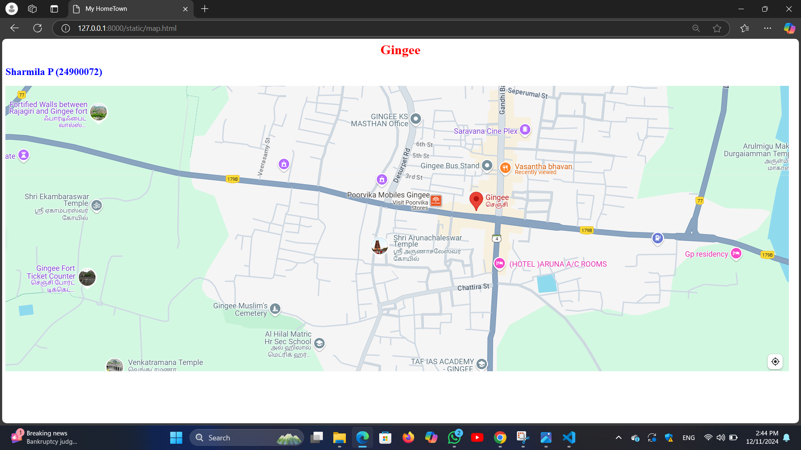
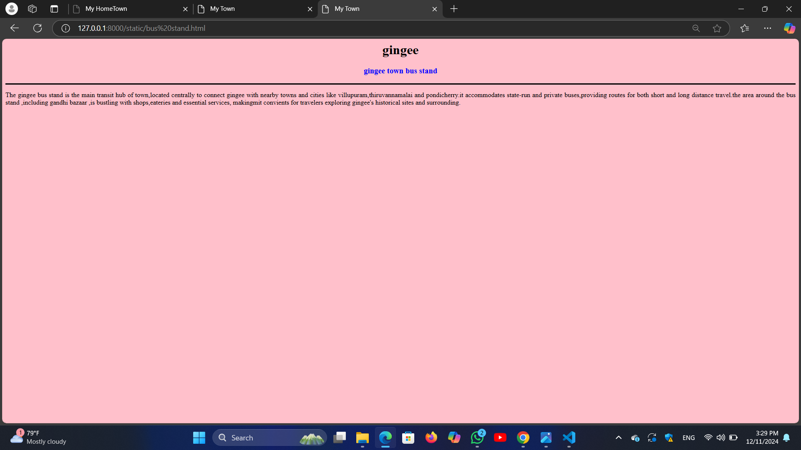

# Ex04 Places Around Me
## Date: 11.12.2024

## AIM
To develop a website to display details about the places around my house.

## DESIGN STEPS

### STEP 1
Create a Django admin interface.

### STEP 2
Download your city map from Google.

### STEP 3
Using ```<map>``` tag name the map.

### STEP 4
Create clickable regions in the image using ```<area>``` tag.

### STEP 5
Write HTML programs for all the regions identified.

### STEP 6
Execute the programs and publish them.

## CODE
```
map.html
<html>
<head>
<title>My HomeTown </title>
</head>
<body>
<h1 align="center">
<font color="red"><b>Gingee</b></font>
</h1>
<h2 align="centre">
<font color="blue"><b>Sharmila P (24900072)</b></font>
</h2>
<centre>


<map name="image-map">
    <area target="" alt="fort" title="fort" href="raja fort.html" coords="41,511,240,402" shape="rect">
    <area target="" alt="temple" title="temple" href="arunachaleswar.html" coords="842,337,1133,430" shape="rect">
    <area target="" alt="bus stand" title="bus stand" href="gingee bus stand.html" coords="988,219,1168,168" shape="rect">
    <area target="" alt="theatre" title="theatre" href="saravana cime plex.html" coords="1067,87,1259,130" shape="rect">
    <area target="" alt="hotel" title="hotel" href="vasantha bhavan.html" coords="1180,172,1372,228" shape="rect">
</map>
</centre>
</body>
</html>

temple.html
<html>
<head>
<title>my Town</title>
</head>
<body bgcolor="lightgreen">
<h1 align="center">
<font color="black"><b>gingee</b></font>    
</h1>
<h3 align="center">
<font color="blue"><b>shri Arunachaleswarar temple</b></font>    
</h3>
<hr size="3" color="black">
<p align="justify">
<front face="Georgia" size="S">
The Shri Arunachaleswarar Temple in Gingee is a lesser-known but spiritually significant temple dedicated to Lord Shiva.
It is located in the Gingee region of Tamil Nadu, a place steeped in history and culture.he temple's name, Arunachaleswarar,
connects it to Lord Shiva as the embodiment of fire and light, much like the more famous Arunachaleswarar Temple in Tiruvannamalai.If
 this temple  holds special meaning to you, it might be due to its tranquil setting or personal memories tied to your visits there.

<p>
</body>
</html>


fort.html
<html>
<head>
<title>My Town</title>
</head>
<body bgcolor="orange">
<h1 align="center">
<font color="black"><b>gingee</b></font>    
</h1>
<h3 align="center">
<font color="blue"><b>raja fort</b></font>    
</h3>
<hr size="3" color="black">
<p align="justify">
<front face="Georgia" size="S">
The Raja Fort,part of the gingee fort complex,a historic hill fortress located in gingee,tamilnadu knowns for its strategic imporatance
and architectural brilliance,it is often referred to as the "TROY OF THE EAST"due to its formidable defenses.The fort's origins date 
back to the 9th century under the cholas,but it gained prominence during the vijayanagar empire in the 14th and 15 th centuries. 
<p>
</body>
</html>

hotel.html
<html>
<head>
<title>My Town</title>
</head>
<body bgcolor="yellow">
<h1 align="center">
<font color="black"><b>gingee</b></font>    
</h1>
<h3 align="center">
<font color="blue"><b>vasantha bhavan</b></font>    
</h3>
<hr size="3" color="black">
<p align="justify">
<front face="Georgia" size="S">
Vasantha Bhavan in gingee is a popular casual dining restaurant located near the bus stand in gandhi bazaar ,old sakkarapuram .it is well
know for its diverse menu,which includes south indian,north indian,chinese and biriyani dishes.the restaurant offers both vegetarian and
non-vegetarian option along with a selection of dessert,attentive staff,and making it a great spot for family dining.  
<p>
</body>
</html>

theatre.html
<html>
<head>
<title>My Town</title>
</head>
<body bgcolor="cyan">
<h1 align="center">
<font color="black"><b>gingee</b></font>    
</h1>
<h3 align="center">
<font color="blue"><b>saravana cine plex </b></font>    
</h3>
<hr size="3" color="black">
<p align="justify">
<front face="Georgia" size="S">
Saravana Theatre in Gingee is a well-known local cinema hall, serving as a popular entertainment hub for the residents of the town and nearby areas. 
It provides a space for people to enjoy the latest Tamil, regional, and occasionally other language films. Like many small-town theaters,
it holds a special place in the hearts of locals, often being associated with fond memories of movie outings with family and friends.
<p>
</body>
</html>

bus stand.html
<html>
<head>
<title>My Town</title>
</head>
<body bgcolor="pink">
<h1 align="center">
<font color="black"><b>gingee</b></font>    
</h1>
<h3 align="center">
<font color="blue"><b>gingee town bus stand </b></font>    
</h3>
<hr size="3" color="black">
<p align="justify">
<front face="Georgia" size="S">
The gingee bus stand is the main transit hub of town,located centrally to connect gingee with nearby towns and cities like villupuram,thiruvannamalai
and pondicherry.it accommodates state-run and private buses,providing routes for both short and long distance travel.the area around the bus stand ,including
gandhi bazaar ,is bustling with shops,eateries and essential services, makingmit convients for travelers exploring gingee's historical sites and surrounding. 
<p>
</body>
</html>
```

## OUTPUT






## RESULT
The program for implementing image maps using HTML is executed successfully.
