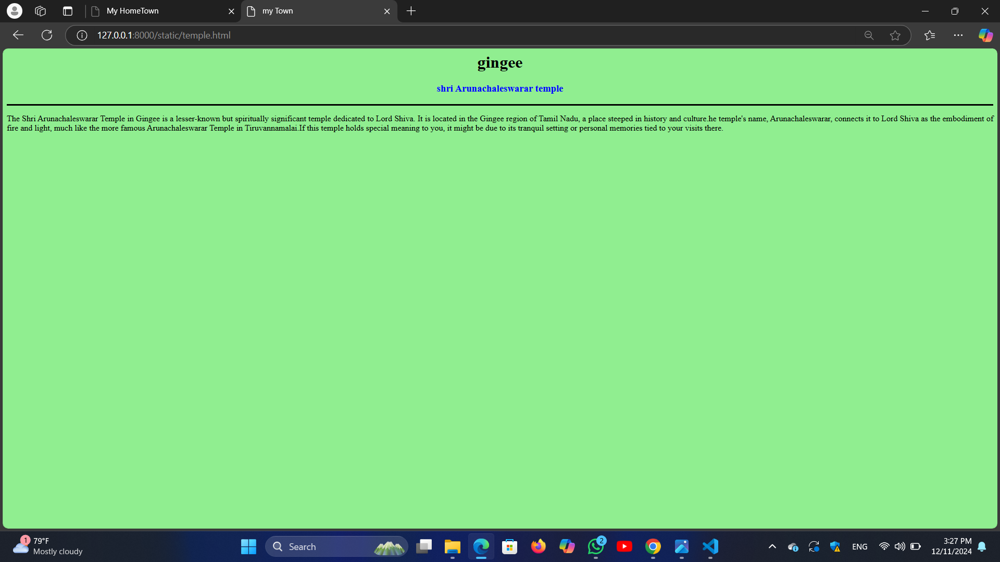
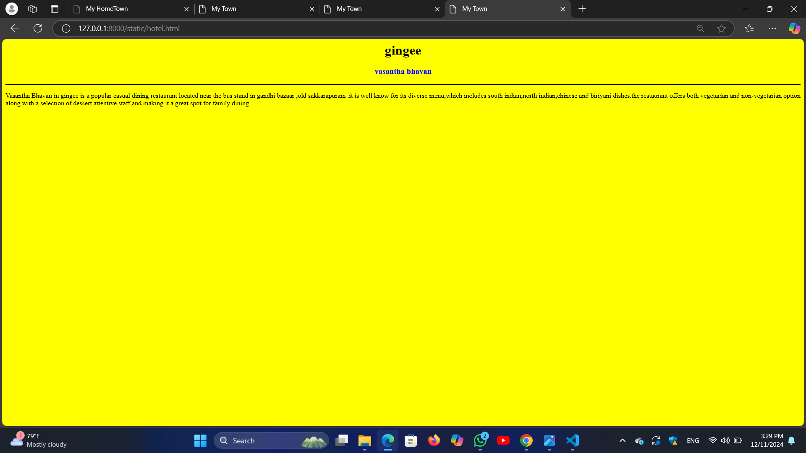
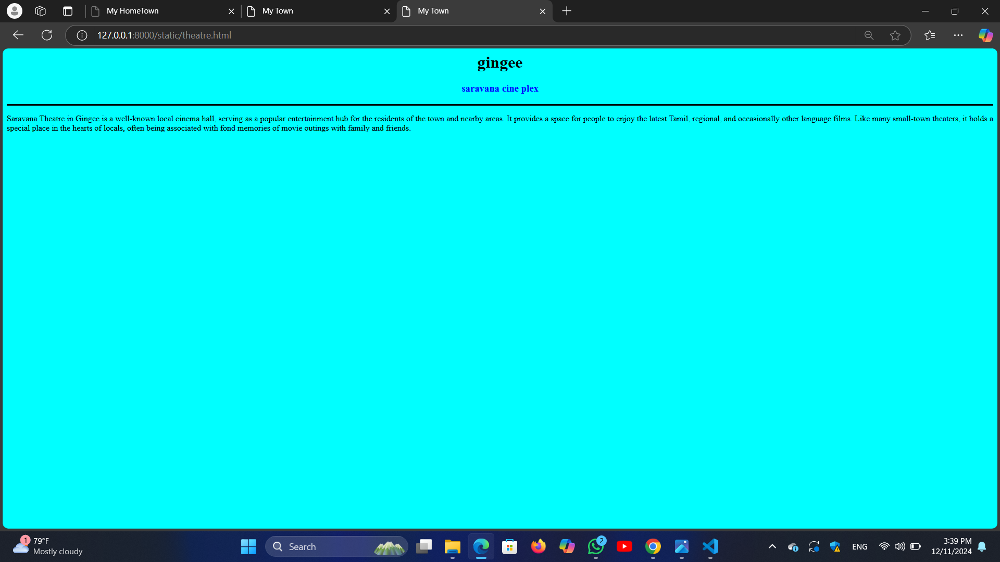

# Ex04 Places Around Me
## Date: 30.11.2024

## AIM
To develop a website to display details about the places around my house.

## DESIGN STEPS

### STEP 1
Create a Django admin interface.

### STEP 2
Download your city map from Google.

### STEP 3
Using ```<map>``` tag name the map.

### STEP 4
Create clickable regions in the image using ```<area>``` tag.

### STEP 5
Write HTML programs for all the regions identified.

### STEP 6
Execute the programs and publish them.

## CODE
```
map.html
<html>
<head>
<title>My HomeTown </title>
</head>
<body>
<h1 align="center">
<font color="red"><b>Gingee</b></font>
</h1>
<h2 align="centre">
<font color="blue"><b>Sharmila P (24900072)</b></font>
</h2>


<map name="image-map">
    <area target="" alt="temple" title="temple" href="ekambaraswar.html" coords="354,390,554,476" shape="rect">
    <area target="" alt="fort" title="fort" href="raja fort.html" coords="114,577,295,521" shape="rect">
    <area target="" alt="hotel" title="hotel" href="vasantha bhavan.html" coords="1099,339,1297,386" shape="rect">
    <area target="" alt="bazaar" title="bazaar" href="gandhi bazaar.html" coords="969,636,1095,569" shape="rect">
    <area target="" alt="bus stand" title="bus stand" href="bus stand.html" coords="" shape="rect">
</map>
</body>
</html>

ekambaraswar.html
<html>
<head>
<title>my Town</title>
</head>
<body bgcolor="lightgreen">
<h1 align="center">
<font color="black"><b>gingee</b></font>    
</h1>
<h3 align="center">
<font color="blue"><b>shri ekambareswar temple</b></font>    
</h3>
<hr size="3" color="black">
<p align="justify">
<front face="Georgia" size="S">
Shri ekambareswar temple in gingee,Tamilnadu is a historic hindu temple dedicated to LORD SHIVA. it is a prominent spiritual 
center in the region and holds architectural and religious significance.it showcases traditional dravidian temple architecture 
characterized by intricate cravings,tall gopurams and a serene ambiance.
<p>
</body>
</html>

raja fort.html
<html>
<head>
<title>My Town</title>
</head>
<body bgcolor="orange">
<h1 align="center">
<font color="black"><b>gingee</b></font>    
</h1>
<h3 align="center">
<font color="blue"><b>raja fort</b></font>    
</h3>
<hr size="3" color="black">
<p align="justify">
<front face="Georgia" size="S">
The Raja Fort,part of the gingee fort complex,a historic hill fortress located in gingee,tamilnadu knowns for its strategic imporatance
and architectural brilliance,it is often referred to as the "TROY OF THE EAST"due to its formidable defenses.The fort's origins date 
back to the 9th century under the cholas,but it gained prominence during the vijayanagar empire in the 14th and 15 th centuries. 
<p>
</body>
</html>

vasantha bhavan.html
<html>
<head>
<title>My Town</title>
</head>
<body bgcolor="yellow">
<h1 align="center">
<font color="black"><b>gingee</b></font>    
</h1>
<h3 align="center">
<font color="blue"><b>vasantha bhavan</b></font>    
</h3>
<hr size="3" color="black">
<p align="justify">
<front face="Georgia" size="S">
Vasantha Bhavan in gingee is a popular casual dining restaurant located near the bus stand in gandhi bazaar ,old sakkarapuram .it is well
know for its diverse menu,which includes south indian,north indian,chinese and biriyani dishes.the restaurant offers both vegetarian and
non-vegetarian option along with a selection of dessert,attentive staff,and making it a great spot for family dining.  
<p>
</body>
</html>

gandhi bazaar.html
<html>
<head>
<title>My Town</title>
</head>
<body bgcolor="cyan">
<h1 align="center">
<font color="black"><b>gingee</b></font>    
</h1>
<h3 align="center">
<font color="blue"><b>gandhi bazaar </b></font>    
</h3>
<hr size="3" color="black">
<p align="justify">
<front face="Georgia" size="S">
Gandhi bazaar in gingee is a bustling commericial area known for its local shops.eateriesand vibrant market atmosphere.it servers as a hub 
for daily shopping needs and features a variety of business,including restaurants like vasantha bhavan,pharmaciesn and traditional shops 
selling goods and groceries.its location near the bus stand make it a convenient spot for traveler and locals alike,offering both modern and
traditional shopping experiences.
<p>
</body>
</html>

bus stand.html
<html>
<head>
<title>My Town</title>
</head>
<body bgcolor="pink">
<h1 align="center">
<font color="black"><b>gingee</b></font>    
</h1>
<h3 align="center">
<font color="blue"><b>gingee town bus stand </b></font>    
</h3>
<hr size="3" color="black">
<p align="justify">
<front face="Georgia" size="S">
The gingee bus stand is the main transit hub of town,located centrally to connect gingee with nearby towns and cities like villupuram,thiruvannamalai
and pondicherry.it accommodates state-run and private buses,providing routes for both short and long distance travel.the area around the bus stand ,including
gandhi bazaar ,is bustling with shops,eateries and essential services, makingmit convients for travelers exploring gingee's historical sites and surrounding. 
<p>
</body>
</html>
```

## OUTPUT




 


## RESULT
The program for implementing image maps using HTML is executed successfully.
